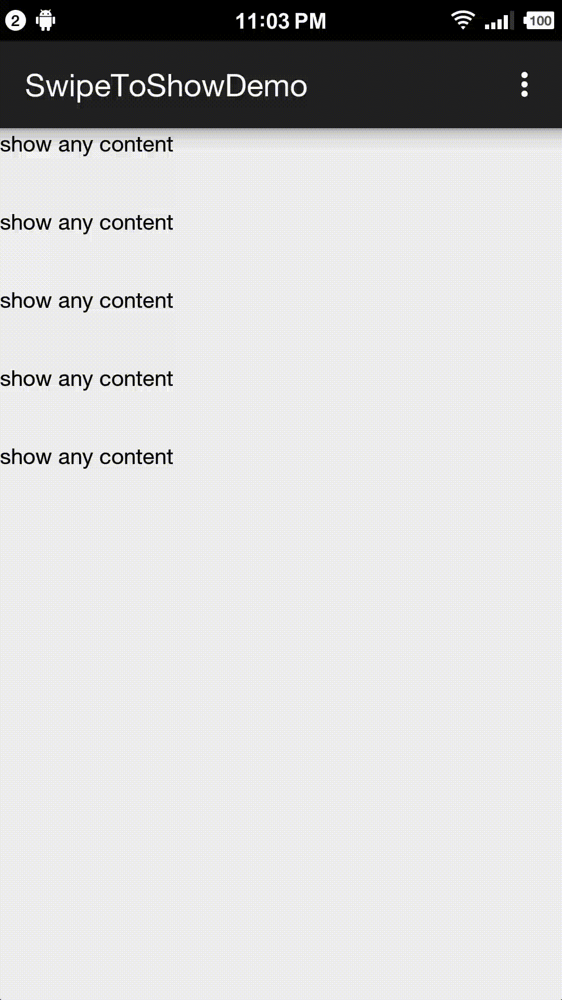

# SwipeToShow
add Swipe to show function to RecyclerView

</img>

##Usage

### edit item layout for recycler view like this
```xml
<?xml version="1.0" encoding="utf-8"?>
<com.itjinks.swipetoshow.SwipeHolder xmlns:android="http://schemas.android.com/apk/res/android"
    android:layout_width="match_parent"
    android:layout_height="50dp">
    <!-- hide content must inside this layout -->
    <com.itjinks.swipetoshow.HideContentHolder
        android:layout_width="74.5dp"
        android:layout_height="match_parent">
        <!-- you can put anything here to let it show when swipe left,
         note that HideContentHolder need a width to let SwipeHolder know how big your view wanna be.
         this hideItem onClick event is notifed in SwipeOnItemTouchAdapter when you register it in
         RecyclerView.addOnItemTouchListener.
         -->
        <Button
            android:layout_width="match_parent"
            android:layout_height="match_parent"
            android:background="#FF3B30"
            android:gravity="center"
            android:text="delete"
            android:textColor="#ffffff" />
    </com.itjinks.swipetoshow.HideContentHolder>

    <!-- anything you like to show -->
    <RelativeLayout
        android:layout_width="match_parent"
        android:layout_height="match_parent"
        >

        <TextView
            android:layout_width="wrap_content"
            android:layout_height="wrap_content"
            android:gravity="center"
            android:textColor="#000000"
            android:text="show any content" />
    </RelativeLayout>
</com.itjinks.swipetoshow.SwipeHolder>
```

###in code
Just need addOnTouchListener
```Java
recyclerView.addOnItemTouchListener(new SwipeOnItemTouchAdapter(this, recyclerView, linearLayoutManager) {
            @Override
            public void onItemHiddenClick(SwipeHolder swipeHolder, int position) {
                Toast.makeText(MainActivity.this, "onItemHiddenClick " + position, Toast.LENGTH_SHORT).show();
                //call reset to hide. 
                //or you will notified a onItemClick event when you click other area in this item which
                //may be not what your want.
                //or if you want click to delete you can add your logic here and don't necessarily need to call below.
                swipeHolder.reset();
            }

            @Override
            public void onItemClick(int position) {
                Toast.makeText(MainActivity.this, "onItemClick " + position, Toast.LENGTH_SHORT).show();
            }
        });
```
